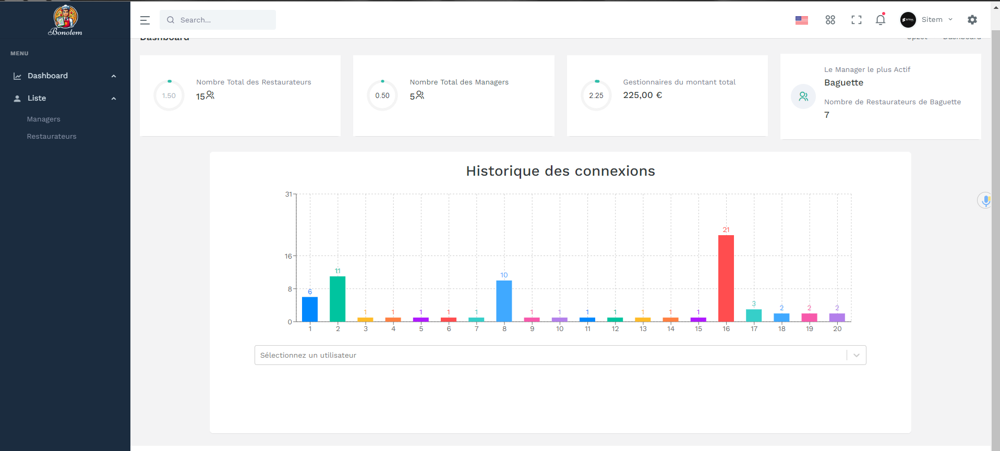

# Bonotem – Système de gestion des ressources et de la finance pour restaurateurs

Ce projet a été réalisé dans le cadre d’une expérience académique entre **février 2024 et mai 2024**. Il propose une plateforme complète de **gestion des ressources**, de **gestion des ventes ** et d’**analyse financière** destinée aux **Restaurateurs** et aux **Managers**.

## 🚀 Fonctionnalités

### 🔐 Authentification et gestion des offres
- Accès basé sur les rôles : Restaurateurs et Managers
- Système d’authentification sécurisé avec login/logout
- Création, modification et suppression des ventes 

### 📦 Gestion des ressources et planification opérationnelle
Gestion et suivi des différentes entités opérationnelles :
- Marchandise  
- Produit  
- Catégorie  
- Ingrédient & Ingrédient composé  
- Packaging  
- Carte/Menu  
- Personnel  
- Planning  
- Fournisseur  

### 📊 Gestion financière et analytique
- Suivi des ventes  
- Suivi des coûts (dépenses et ventilation)  
- Suivi des pertes  
- Gestion des charges fixes et variables  
- Calcul du chiffre d’affaires et du bénéfice  
- Affichage visuel des indicateurs financiers clés

### 📈 Visualisation et analyse
- Intégration de graphiques et courbes pour l’analyse des données financières  
- Fonctionnalités de tri et de filtrage des données pour des analyses ciblées et pertinentes  

## 🛠️ Technologies utilisées

- **Frontend :** React + Redux  
  - Répertoire : `Admin/src`  
- **Backend :** Laravel  
  - Répertoire : `devenci-test-back`  
  - Structure Laravel : `app/`, `database/`, `public/`, `resources/`, `routes/`, `storage/`, `tests/`, etc.

## 📚 Compétences développées

- Développement full-stack avec Laravel et React  
- Conception d’architecture modulaire pour les systèmes complexes  
- Intégration d’interfaces de visualisation financière (tableaux, graphiques)  
- Travail collaboratif avec Git et gestion de version

## 📸 Captures d’écran


## 📂 Structure du projet


```
/Admin/src                 → Code source du frontend React avec Redux
/devenci-test-back/       → Code backend Laravel
    ├── app/              → Logique métier (controllers, models, etc.)
    ├── database/         → Migrations et seeders
    ├── public/           → Point d'entrée web
    ├── resources/        → Vues Blade (si utilisées) et assets
    ├── routes/           → Fichiers de routage Laravel
    ├── storage/          → Fichiers générés ou stockés
    ├── tests/            → Tests unitaires et fonctionnels
```

## 👤 Auteur

**Wael BEN SALEM**  
[LinkedIn](https://www.linkedin.com/in/wael-ben-salem/299060237/)  
[GitHub](https://github.com/wael-ben-salem)

---


